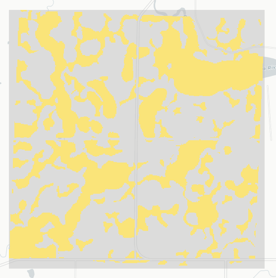
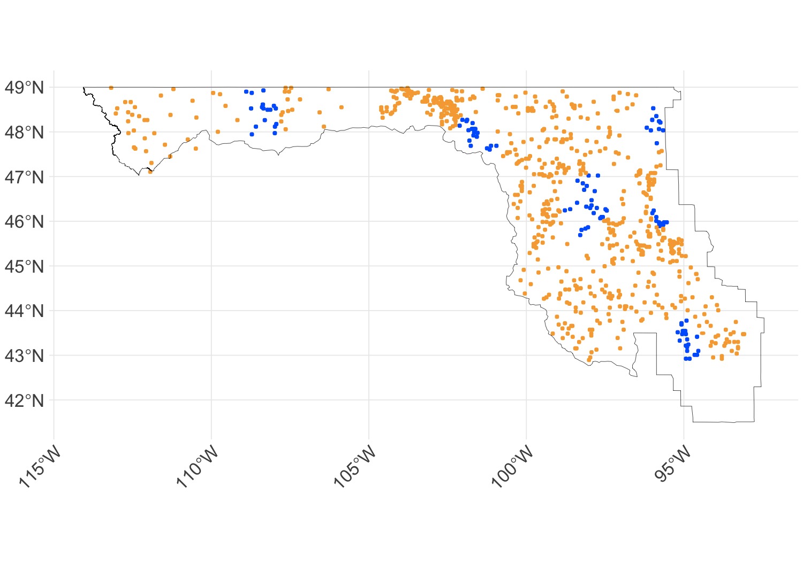

# PPR Pond Mapper

The PPR Pond Mapper is an open-source tool for **monitoring surface water within wetlands, lake, and river boundaries** across the United States portion of the Prairie Pothole Region (PPR). Developed in collaboration with the Prairie Pothole Joint Venture, Ducks Unlimited, and the U.S. Fish and Wildlife Service, this tool supports conservation and research efforts by providing consistent, spatially explicit wetland inundation data.

*This GitHub Repo stores the code used to build and evaluate the PPR Pond Mapper.*

To use the tool, visit [GEE link]. Simply select your area and timespan of interest, then click Run to generate predictions. The output is a **10-meter resolution** map showing areas likely to be inundated or dry.  More detailed guidance can be found [here].

## How we built the model 
We trained a random forest model on thousands of aerial images, captured by the US Fish & Widlife's (USFWS) Habitat and Population Evaluation Team ("HAPET") over 680 4mi^2 plots and 9 survey periods between 2016-2024. These images have a 1.5m resolution and are digitized by HAPET into surface water polygons. 

### Wetland Footprint 
To focus predictions, we limit analysis to pixels with historical evidence of wetlands within the PPJV administrative boundary, based on multiple data sources:

* USFWS National Wetland Inventory (NWI)
* JRC Global Surface Water Maximum Water Extent
* USFWS HAPET surveys
* USDA Soil Survey Geographic Database (SSURGO) hydric soils  
* Exclude Census roads

  

<em>Wetland footprint sources (white areas indicate wetland evidence).</em>

These sources are combined in Google Earth Engine to generate a wetland footprint mask.

  

<em>Historic wetland footprint of a plot (yellow).</em>

### Sampling Strategy (R scripts 1-7)

We use stratified sampling to select training points, selecting 200 water and 200 non-water points from each plot-survey-ecoregion.

* Inundated points are sampled by randomly selecting one point per pond in repeated cycles until the stratum sample size is reached.
     * We don't sample from ponds with surface areas < 400 m² (to avoid mixed pixels) 
* Non-inundated points are randomly sampled from historical wetland areas that were dry at the time of survey.
* All sampled points are $\geq$ 7.5m from pond edges (to avoid mixed pixels) and $\geq$ 20m apart (to avoid duplicate Sentinel-2 pixels).

### Predictor Extraction
In Google Earth Engine, we extract predictors to each sampled point:

* **Sentinel-1** C-band SAR -- Level-1 Ground Range Detected (GRD) ascending orbits.
  * Preprocessing steps: We apply border noise correction, speckle filtering, and radiometric terrain normalization via an [open-source script](https://github.com/adugnag/gee_s1_ard).
* **Sentinel-2** 10- and 20-m bands -- Level-2A where available in GEE (2019+), Level-1C otherwise. 
  * Preprocessing steps: We mask pixels occluded by clouds or cloud-shadow using a [CS+](https://developers.google.com/earth-engine/datasets/catalog/GOOGLE_CLOUD_SCORE_PLUS_V1_S2_HARMONIZED) threshold of 0.6. We also atmospherically correct L1C images (2016-2017) via an [open-source script](https://github.com/MarcYin/SIAC_GEE). 
  * We calculate 35 spectral indicies known to be useful for detecting water.
* **Topographic depression indicies** at 30m and 90m resolution ([source](https://gee-community-catalog.org/projects/hand/))
* **Drought indices** from GridMET ([source](https://developers.google.com/earth-engine/datasets/catalog/GRIDMET_DROUGHT))

### Train/Test Design (R scripts 8-10)

Test/train split: 

* **Out-of-time testing**: We hold out data from August 2016, May 2022, and May 2024 to evaluate model performance across a range of climatic conditions. These test periods span both dry and wet extremes [insert time series of PHDI with standard deviation].

* **Out-of-space testing**: We also hold out clusters of plots located in distinct Level III ecoregions to assess the model’s spatial generalizability across ecological gradients.

  

<em>Out-of-space Test Set (training data is orange, test data is blue).</em>

Spatiotemporally balanced training set:

* We enforce balanced sampling across time and space by drawing an equal number of points from each survey within a 51-cell hexagonal grid. Each cell-survey includes 450 inundated and 450 dry points, yielding over 100,000 training samples.

### Model Selection (R scripts 11-12)
* **Features**: We use recursive feature elimination, guided by spatial and temporal cross-validation, to select a reduced and uncorrelated feature set. 
* **Hyperparameters:** We tuned random forest hyperparameters on the reduced feature set, using a grid search.

## Contact information
Maggie Church 
mgchurch247@gmail.com

Jessica O'Connell
jessica.oconnell@colostate.edu
