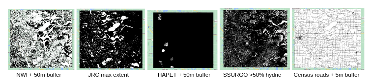
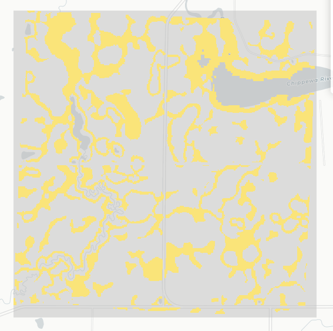

# PPR Pond Mapper

The PPR Pond Mapper is an open-source tool for **monitoring surface water within wetlands** across the United States portion of the Prairie Pothole Region (PPR). Developed in collaboration with the Prairie Pothole Joint Venture, Ducks Unlimited, and the U.S. Fish and Wildlife Service, this tool supports conservation and research efforts by providing consistent, spatially explicit wetland inundation data.

----

How it works: 

We trained a random forest model on thousands of aerial images (1.5m resolution, digitized into surface water polygons by experts) across 680 4 mi^2 plots and 9 survey periods between 2016-2024. 

Technical details: 
1.  First, we create a tif of our area of interest in Google Earth Engine. These are areas with evidence of historical wetland footprint, as indicated by:
    * The National Wetland Inventory
    * The Global Surface Water's max water extent layer
    * The Soil Survey Geographic Database's hydric soils layer 
    * Our aerial surveys
    * (Minus Census roads)

  

<em>Wetland footprint sources (white areas indicate wetland evidence).</em>

When you combine these sources, we get an area of interest like this: 

  

<em>Historic wetland footprint of a plot.</em>

2.  Scripts 1-7 sample from wet and dry areas within historic wetland footprints:
  * First, we remove all ponds <400m2. Next, we randomly sample 200 wet points per plot-survey: we pick 1 point per pond, and cycle back through to pick new points, until we reach 200. Resample points if necessary. We avoid sampling within 7.5m of the pond's edge, to avoid mixed pixels. 
  * Randomly sample 200 dry points per plot-survey. We limit 
  

We sample multiple points across the inundated polygons (wet points) and outside of the polygons within historic wetland footprints (dry points) to drive a pixel-based classifier. We ensure our samples are equally stratified across time and space, for consistent performance.
