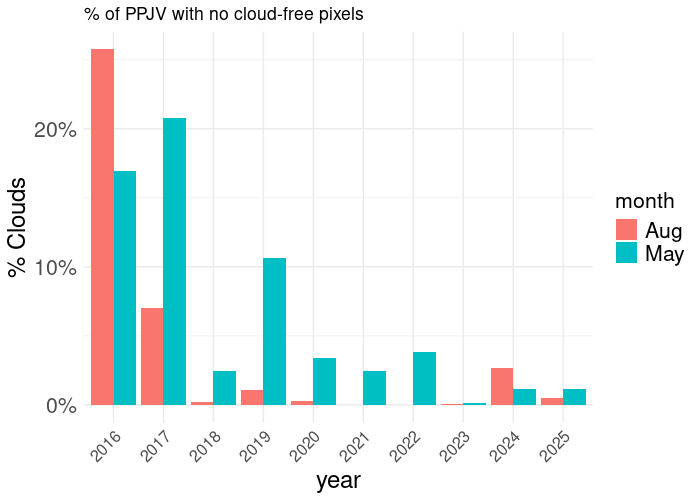
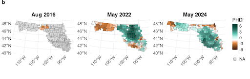
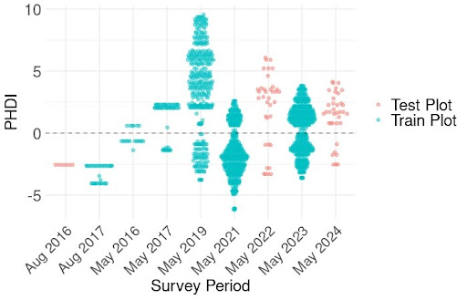

# PPR Pond Mapper

The PPR Pond Mapper is an open-source tool for **monitoring surface water** within wetlands, lake, and river boundaries across the United States portion of the Prairie Pothole Region (PPR). Developed in collaboration with the Prairie Pothole Joint Venture, Ducks Unlimited, and the U.S. Fish and Wildlife Service, this tool supports conservation and research efforts by providing consistent, spatially explicit wetland inundation data.

To use the tool, visit [GEE link](https://code.earthengine.google.com/2f358b4afc3a98f4a21105bf6b5d68dc). Simply select your area and timespan of interest, then click Run to generate predictions. The output is a **10-meter resolution** map that classifies each pixel into either:

0 - nonwater   1 - water   2 - nonwetland   3 - cloud/shadow  

-   *Cloud Gaps*: This model relies on Sentinel-2 Imagery, which may contain cloud gaps. Sentinel-2 has a revisit interval of 10 days before 2018, and 5 days after. Based on input from end-users, we added an option to to gap-fill the user-selected time window with the following 15 days' worth of imagery. Below is an example of what full-month coverage looks like across the U.S. PPR:

    

    

    

    

    <em> Cloud coverage in full-month imagery. </em>

    

  We also provided the option to gap-fill a second time, with another subsequent 15 days.

*This GitHub Repo stores the code used to build and evaluate the PPR Pond Mapper.*

## How we built the model

We trained a random forest model on thousands of aerial images, captured by the US Fish & Widlife's (USFWS) Habitat and Population Evaluation Team ("HAPET"; additional plots provided with Duck's Unlimited's support) over 680 four-square-mile plots and 9 survey periods between 2016-2024. These images have a 1.5m resolution and are digitized into surface water polygons.

### Wetland Footprint

To focus predictions, we limit analysis to pixels with historical evidence of wetlands within the PPJV administrative boundary, based on multiple data sources:

-   USFWS National Wetland Inventory (NWI)
-   JRC Global Surface Water Maximum Water Extent
-   USFWS HAPET surveys
-   USDA Soil Survey Geographic Database (SSURGO) hydric soils\
-   Census roads - for exclusion

<em>Wetland footprint sources (white areas indicate wetland evidence).</em>

These sources are combined in Google Earth Engine to generate a wetland footprint mask.

<em>Historic wetland footprint of an area in Minnesota</em>

#### Combined and cleaned pond shapefiles (R scripts 1-3)

#### Sampled candidate training data (R scripts 4-7)

From the pond shapefiles, we selected candidate water and non-water training points:

-   Inundated points were sampled by randomly selecting one point per pond in repeated cycles until the stratum sample size was reached.
    -   We didn't sample from ponds with surface areas \< 400 m², to avoid training on mixed pixels
-   Non-inundated points were randomly sampled from historical wetland areas that were dry at the time of survey and not considered permanent water by JRC's Global Surface Water product.
-   All sampled points were $\geq$ 7.5m from pond edges (to avoid mixed pixels) and $\geq$ 20m apart (to avoid duplicate Sentinel-2 pixels)

#### Predictor Extraction

In Google Earth Engine, we extracted predictors to each sampled point:

-   **Sentinel-1** C-band SAR -- Level-1 Ground Range Detected (GRD) ascending orbits.
    -   Preprocessing steps: We applied border noise correction, speckle filtering, and radiometric terrain normalization via an [open-source script](https://github.com/adugnag/gee_s1_ard).
-   **Sentinel-2** 10- and 20-m bands -- Level-2A where available in GEE (2019+), Level-1C otherwise.
    -   Preprocessing steps: We masked pixels occluded by clouds or cloud-shadow using a [CS+](https://developers.google.com/earth-engine/datasets/catalog/GOOGLE_CLOUD_SCORE_PLUS_V1_S2_HARMONIZED) threshold of 0.6. We also atmospherically corrected L1C images (2016-2017) via an [open-source script](https://github.com/MarcYin/SIAC_GEE).
    -   We calculated 35 spectral indicies known to be useful for detecting water.
-   **Topographic depression indicies** at 30m and 90m resolution ([source](https://gee-community-catalog.org/projects/hand/))
-   **Drought indices** from GridMET ([source](https://developers.google.com/earth-engine/datasets/catalog/GRIDMET_DROUGHT))

#### Test/train split (R scripts 8-10):

-   *Out-of-time testing*: We held out data from August 2016, May 2022, and May 2024 to evaluate model performance across a range of climatic conditions. These test periods span both dry and wet extremes.

    

    

    

    

    <em> Palmer Hydrological Drought Index (PHDI) for training data (blue) and testing data (pink). Each point represents the PHDI for a given HAPET FSMS plot at the time of survey. More negative PHDI values indicate drier conditions, and more positive values indicate wetter conditions. Data from NOAA National Centers for Environmental Information. </em>

    

-   *Out-of-space testing*: We also held out clusters of plots located in distinct Level III ecoregions to assess the model’s spatial generalizability across ecological gradients.

  

  
  
  
  

  
  

  
  <em> Spatial distribution of training data (blue) and testing data (pink). Basemap imagery from ©2015 Google. </em>
  
  

-   We enforce balanced sampling across time and space by drawing an equal number of points from each survey within a 51-cell hexagonal grid. Each cell-survey includes 750 inundated and 750 dry points (well, weighted...), yielding over 100,000 training samples.

#### Model Selection (R scripts 11-12)

-   **Features**: We use recursive feature elimination, guided by spatial and temporal cross-validation, to select a reduced and uncorrelated feature set.
-   **Hyperparameters:** We tuned random forest hyperparameters on the reduced feature set, using a grid search.

#### Model Evaluation

These scripts are forthcoming

## Contact information

Maggie Church [mgchurch247\@gmail.com](mailto:mgchurch247@gmail.com){.email}

Jessica O'Connell [jessica.oconnell\@colostate.edu](mailto:jessica.oconnell@colostate.edu){.email}
