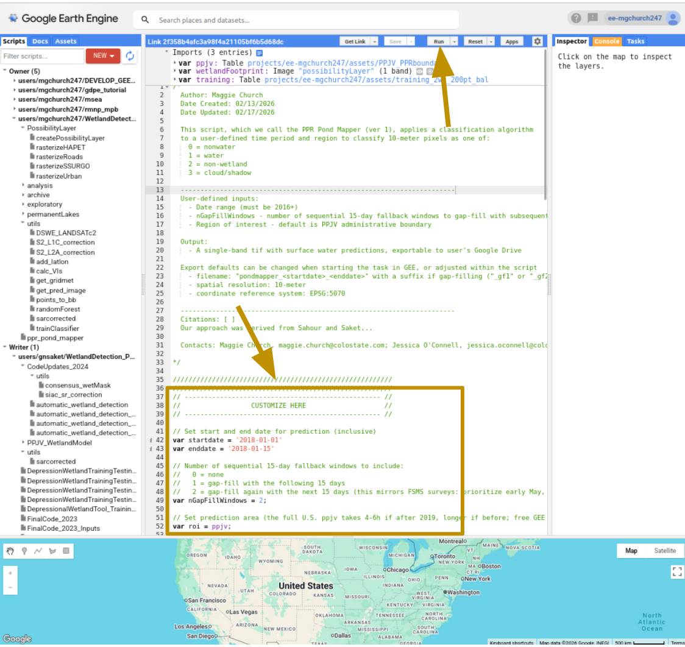
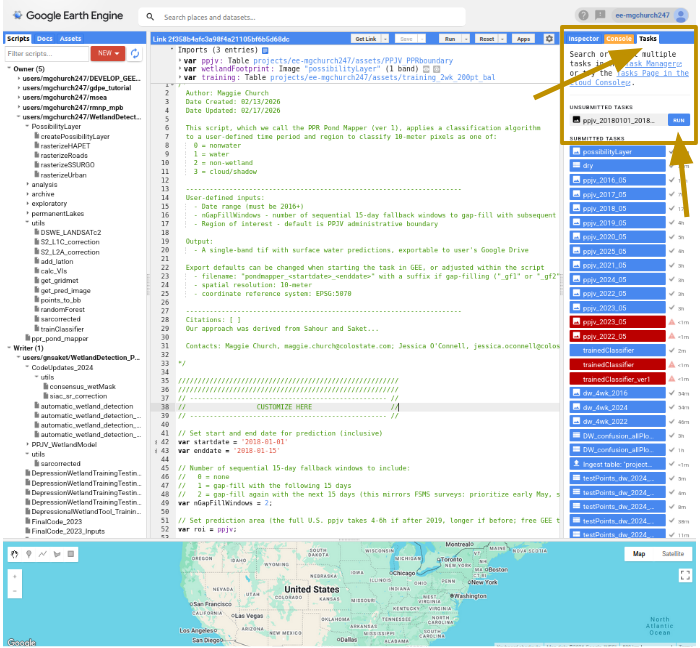
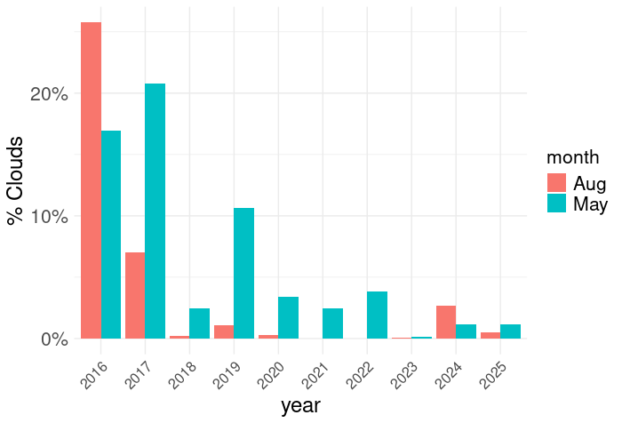
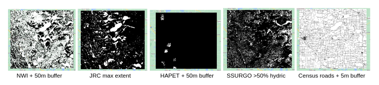
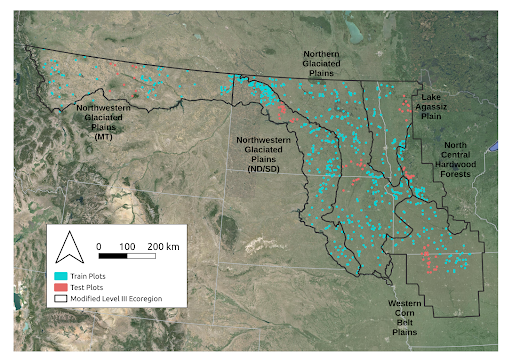

# Prairie Pothole Mapper

The Prairie Pothole Mapper is an open-source tool for **monitoring surface water** within wetlands, lake, and river boundaries across the United States portion of the Prairie Pothole Region (PPR). Developed in collaboration with the Prairie Pothole Joint Venture, Ducks Unlimited, and the U.S. Fish and Wildlife Service, this tool supports conservation and research efforts by providing consistent, spatially explicit wetland inundation data.

## How to use

To use the tool, visit [GEE link](https://code.earthengine.google.com/2f358b4afc3a98f4a21105bf6b5d68dc). Simply select your area and timespan of interest then click "Run" to generate predictions.

  

 

Export to your Google Drive to explore the resulting raster in your preferred software.

  

 

The output is a **10-meter resolution** map that classifies each pixel into either:   
    0 - nonwater   
    1 - water   
    2 - nonwetland   
    3 - cloud/shadow  

  

#### Cloud Gaps:
This model relies on Sentinel-2 Imagery, which may contain cloud gaps. Sentinel-2 has a revisit interval of 10 days before 2018, and 5 days after. Based on input from end-users, we added an option to to gap-fill the user-selected time window with the following 15 days' worth of imagery. 
   
Below is an example of what full-month coverage looks like across the U.S. PPR:

<strong>Monthly Cloud Coverage</strong>

We also provided the option to gap-fill a second time, with another subsequent 15 days.

## How we built the model

*This GitHub Repo stores the code used to build and evaluate the Prairie Pothole Mapper.*

We trained a random forest model on thousands of aerial images, captured by the US Fish & Widlife's (USFWS) Habitat and Population Evaluation Team ("HAPET"; additional plots provided with Duck's Unlimited's support) over 680 four-square-mile plots and 9 survey periods between 2016-2024. These images have a 1.5m resolution and are digitized into surface water polygons.

### Wetland Footprint

To focus predictions, we limited analysis to pixels with historical evidence of wetlands within the PPJV administrative boundary, based on multiple data sources:

-   USFWS National Wetland Inventory (NWI)
-   JRC Global Surface Water Maximum Water Extent
-   USFWS HAPET surveys
-   USDA Soil Survey Geographic Database (SSURGO) hydric soils
-   Census roads - for exclusion

These sources were combined in Google Earth Engine to generate a wetland footprint mask.

<strong>Wetland footprint sources (white areas indicate wetland evidence)</strong> 

  <strong>Historic wetland footprint of an area in Minnesota</strong> 
  

#### **1. Data preparation (R scripts 1-3)**
We first combined and cleaned pond shapefiles. 

#### **2. Sample selection (R scripts 4-7)**

From the pond shapefiles, we selected candidate water and non-water training points:

-   Inundated points were sampled by randomly selecting one point per pond in repeated cycles until the stratum sample size was reached.
    -   We didn't sample from ponds with surface areas \< 400 m², to avoid training on mixed pixels
-   Non-inundated points were randomly sampled from historical wetland areas that were: 
    - dry at the time of survey, and 
    - not considered permanent water by JRC's Global Surface Water product
-   All sampled points were 
    - $\geq$ 7.5m from pond edges (to avoid mixed pixels), and
    - $\geq$ 20m apart (to avoid duplicate Sentinel-2 pixels)

#### **3. Predictor Extraction**

In Google Earth Engine, we extracted candidate features to each sampled point:

-   **Sentinel-1** C-band SAR 
    - 10-m resolution
    - Level-1 Ground Range Detected (GRD) ascending orbits
    - Preprocessing steps: border noise correction, speckle filtering, and radiometric terrain normalization via an [open-source script](https://github.com/adugnag/gee_s1_ard)
-   **Sentinel-2** 
    -   10- and 20-m resolution 
    -   Level-2A where available in GEE (2019+), Level-1C otherwise
    -   Preprocessing steps:
         - Cloud and shadow masking, using a [Cloud Score+](https://developers.google.com/earth-engine/datasets/catalog/GOOGLE_CLOUD_SCORE_PLUS_V1_S2_HARMONIZED) threshold of 0.6
         - Atmospheric correction for L1C images (2016-2017) via an [open-source script](https://github.com/MarcYin/SIAC_GEE)
    -   We calculated 35 spectral indicies known to be useful for detecting water.
-   **Topographic depression indicies** 
    - 30m and 90m resolution ([source](https://gee-community-catalog.org/projects/hand/))
-   **Drought indices** 
    - 4.6km resolution, from GridMET ([source](https://developers.google.com/earth-engine/datasets/catalog/GRIDMET_DROUGHT))
-    **Soil data**
    - Hydric soils polygons from SSURGO ([source](https://websoilsurvey.sc.egov.usda.gov/App/WebSoilSurvey.aspx))

#### **4. Test/train design (R scripts 8-10):**

We held out data from August 2016, May 2022, and May 2024, so that both model training and evaluation represented a range of climate conditions  to evaluate model performance across a range of climatic conditions.

   
  

  Palmer Hydrological Drought Index (PHDI) for training data (blue) and testing data (pink). Each point represents the PHDI for a given HAPET FSMS plot at the time of survey. More negative PHDI values indicate drier conditions, and more positive values indicate wetter conditions. Data from NOAA National Centers for Environmental Information.
  

 

We also held out clusters of plots located in distinct Level III ecoregions, to assess the model’s spatial generalizability across ecological gradients.

  
  

    Spatial distribution of training data (blue) and testing data (pink). Basemap imagery from ©2015 Google.
  

  

For plot-surveys not held out for testing, we used stratified random sampling to select a final training dataset. 
We enforced balanced sampling across space and time using a 51-cell hexagonal grid. 
Within each cell-survey combination, we sampled 750 water and 750 nonwater points, yielding over 140,000 training samples.

#### **5. Model Selection (R scripts 11-12)**

-   **Features**: We use recursive feature elimination, guided by spatiotemporal cross-validation, to select a reduced and uncorrelated feature set.
-   **Hyperparameters:** We tuned random forest hyperparameters on the reduced feature set, using a grid search.

#### **6. Model Evaluation**

These scripts are forthcoming

**To explore model performance on test plots:** download `test_plot_viewer.html` and open it in your browser to compare model predictions with HAPET observations.

## Contact information

Maggie Church [mgchurch247\@gmail.com](mailto:mgchurch247@gmail.com){.email}

Jessica O'Connell [jessica.oconnell\@colostate.edu](mailto:jessica.oconnell@colostate.edu){.email}
