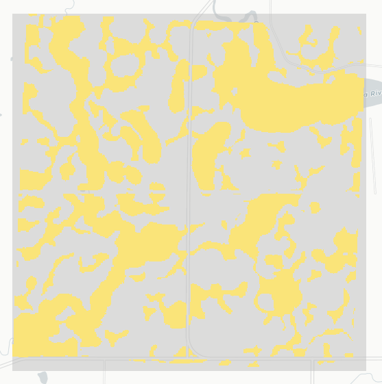
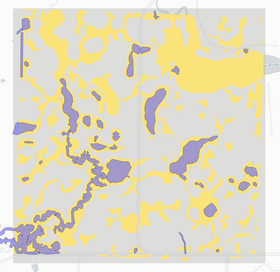
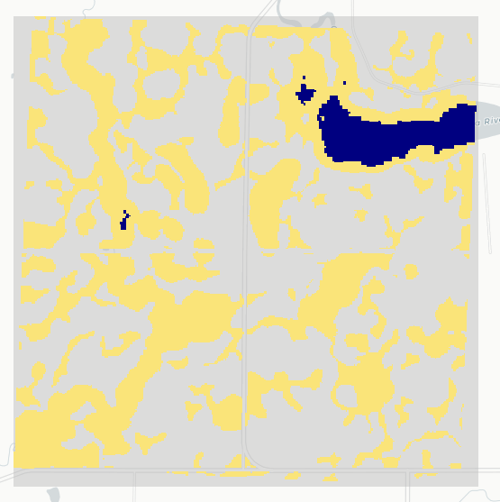
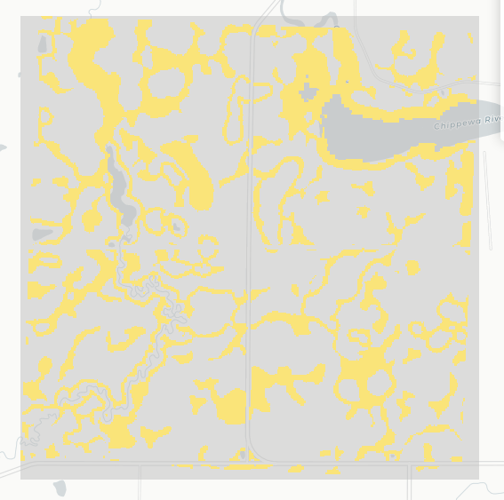
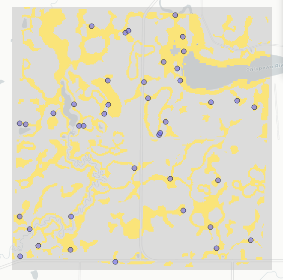

**Description**: Limit the Possibility Layer to known dry areas (not wet in HAPET, and not a permanent water body). We will randomly sample dry points from within this area, to train the model what is dry.

The output of this is a shapefile of sampled dry points - we'll use this to split train/test, and extract remotely-sensed features.

**Steps:** For a given plot:

1.  load possibility raster for that plot

```{r, echo=FALSE}
knitr::include_graphics(here("figures", "dry_sampling_steps_plot262", "1.poss.png"))
```

2.  remove edges

    {width="198"}

3.  get ponds

    {width="208"}

4.  get permanent water

    {width="208"}

5.  mask ponds and permanent water from possibility layer

    {width="198"}

6.  randomly sample points within this dry ROI

    {width="191"}

## Load packages:

```{r, message=F, warning=F}
library(tidyverse)
library(sf)
library(terra)
library(future.apply)
library(parallel)
library(tools)
library(mapview)

w <- detectCores()

utm14 <- 32614
wgs <- 4326
```

## Load HAPET pond boundaries and apply a 7.5m buffer.

```{r, message=F, warning=F}
# read in preprocessed and combined HAPET data
allPonds <- st_read(here("data", "allPonds"))

# apply 15m outward buffer to ponds
ponds_outbuff75 <- st_buffer(allPonds, 7.5)

# List raster files
cropped_poss_files <- list.files(here("data", "intermediate", "raster_processing", "cropped_poss_rasters"), full.names = TRUE) 
cropped_permWater_files <- list.files(here("data", "intermediate", "raster_processing", "cropped_permWater_rasters"), full.names = TRUE) 
```

## create fn to remove known wet areas from possibility layer -\> sample dry points.

```{r}
# Define a function to process each plot
sample_dry <- function(p, d) {
  
  # Skip plots 914 and 945 (these aren't within the PPR boundary)
  if (p %in% c(914, 945)) {
    message(paste("Skipping plot", p))
    return(NULL)  # Skip to the next plot
  }
  
  # 1. Get the possibility raster for this plot
  poss_file <- grep(paste0("_", p, "\\.tif$"), cropped_poss_files, value = TRUE)
  poss_i <- rast(poss_file)  # Read the file

  # 2. Only use non-edge pixels of possibility layer
  poss_i <- as.numeric(poss_i == 1)  
  poss_i <- mask(poss_i, poss_i, maskvalue = FALSE)  # Convert 0 to NA
  
  # 3. Get the ponds for this plot
  ponds_i <- filter(ponds_outbuff75, dataset == d & Plot == p)
  
  # 4. Get the permanent water for this plot
  perm_file <- grep(paste0("_", p, "\\.tif$"), cropped_permWater_files, value = TRUE)
  
  # Snap permanent water raster to poss_i -- add a 30m buffer too
  perm_i <- perm_file %>%
      rast() %>%        
      resample(poss_i) 
  
  # Convert 0 to NA
  perm_i <- mask(perm_i, perm_i, maskvalue = FALSE)   
  
  # add 30m buffer to the permanent water raster
  perm_i <- perm_i %>% focal(w = matrix(1, 7, 7), fun = max, na.rm = TRUE) 
  
  # Add some areas that the perm water layer missed (I created this layer manually)
  perm_more <- st_read(here("data", "intermediate", "jrc_missed")) %>% 
    st_transform(st_crs(perm_i)$wkt)

  # 5. Remove actively wet areas from the possibility raster for this plot
  dryROI_subset <- poss_i %>%
    mask(ponds_i, inverse = TRUE) %>% 
    mask(perm_i, inverse = TRUE) %>% 
    mask(perm_more, inverse = TRUE) 
  
  # 6. Sample points (200 per plot-year)
  sampled_points <- 
    spatSample(dryROI_subset, 
               size = 200, 
               method = "random", 
               na.rm = TRUE, 
               as.points = TRUE) %>%
      st_as_sf()
  
  # If no points were sampled, return NULL
  if (nrow(sampled_points) == 0) {
    message(paste("No points sampled for plot", p))
    return(NULL)
  }

  # Add attributes
  sampled_points$plot_id <- p
  sampled_points$dataset <- d
  sampled_points$flyvr_d <- unique(pull(ponds_i, flyvr_d))
  
  return(sampled_points)
}
```

## Run function

Btw plots 914 and 945 are missing from the possibility rasters... They're outside of the PPJV boundary.

```{r}
set.seed(123)

# set up parallel processing
plan(multisession, workers = w-2)

# Initialize a list to store results for all datasets
all_sampled_points_list <- list()

# get the dataset names
datasets <- ponds_outbuff75 %>% st_drop_geometry() %>% distinct(dataset) %>% pull()

# Use lapply to apply the process to all plots, within a given dataset d
for (d in datasets) {

  # Plots surveyed in dataset d
  plots_d <- ponds_outbuff75 %>%
    filter(dataset == d) %>%
    pull(Plot) %>%
    unique() %>%
    na.omit() %>%
    as.vector()
  
  # Sample dry points for this dataset
  sampled_points <- lapply(plots_d, sample_dry, d = d)
  sampled_points_sf <- bind_rows(sampled_points)
  
  # Append the dataset's sampled points to the main list
  all_sampled_points_list[[d]] <- sampled_points_sf
}

# combine the results into one sf object
###### this is throwing an error
dryPoints_sf <- bind_rows(all_sampled_points_list, .id = "dataset")

# Reset the plan to sequential (no parallelization)
plan(sequential)
```

```{r}
# Get state info
states <- st_read(here("data", "boundaries", "states")) %>%
  st_transform(utm14) %>% 
  select(STATEFP, STUSPS)

# Add state info to points
dryPoints_sf_wstate <- dryPoints_sf %>%
  st_join(states) %>%  # add state info
  st_transform(wgs)    # set to WGS before exporting

st_write(dryPoints_sf_wstate, here("data", "intermediate", "sampled_coordinates", "dry.shp"), append=FALSE)
```

```{r, echo=F, eval=F}
p = 262
  
# make figures
mapview(poss, col.regions='#fae479')
mapview(poss, col.regions='#fae479') + mapview(ponds, legend=F)
mapview(poss, col.regions='#fae479') + mapview(perm, legend=F, col.regions="navy", na.color="transparent")
mapview(dryROI_subset, col.regions='#fae479')
mapview(dryROI_subset, col.regions='#fae479') + mapview(sampled_points, alpha=1, cex=5)
```

Next, I upload the exported dry points to GEE to extract their predictors, then save those results at PPR/samplePoints/data/inputs.
